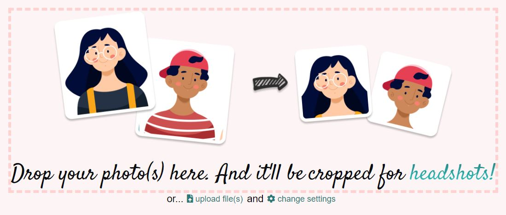
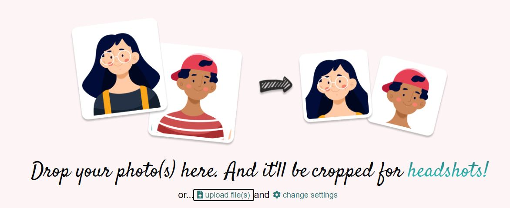
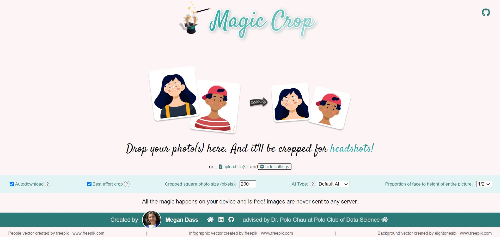

# Magic Crop

A website that uses AI and the rule of thirds to automatically crop inputted pictures into perfect square headshots without sending images to any server. It can even batch-crop multiple images!

[**Live Demo** - Launch Magic Crop in your browser](https://poloclub.github.io/magic-crop/)

## Demo of Site

## Feature Highlights

### Input Files

Drag and drop your image from your machine onto the page. Magic Crop supports batch cropping multiple images, so go ahead and drag multiple images in, and save tons of time!

Alternatively, you can use the "upload file(s)" button to browse the file explorer for your image.

#### Where Does The Magic Come from?
Magic Crop detects your face using [face-api.js](https://github.com/justadudewhohacks/face-api.js/), then resizes and crops your photo, so your eye is placed roughly at 1/3 of the image height, and your face is roughly 1/2 of image height.

### Modify Settings

Click the "change settings" icon to open the settings menu. Here, you can change the following options:

#### Auto-download

By default, the cropped image will automatically download in your downloads folder using the naming format: originalFileName_cropped and the file type of the original file. Alternatively, if you turn auto-download off, you can right click on the image on the site and click "save image as..."

#### Best Effort Crop

If the picture you chose is too narrow for the selected proportion of the height of the face to the height of the entire picture, then your picture will be cropped to the size chosen and the proportion of face height will be as small as possible.

#### Cropped Square Photo Size

By default, your cropped image will be resized to 200x200 pixels. Input a number to change the size of the image.

#### Proportion of Face to Height of Entire Picture:

By default, the height of the face in the image will take up 1/2 of the height of the entire picture. Use the dropdown to change the height to face height ratio.

## Credits
Magic Crop was created by 
<a href="http://megandass.me/">Megan Dass</a>,
advised by 
<a href="https://www.cc.gatech.edu/~dchau/">Dr. Polo Chau</a>

## License

The software is available under the [MIT License](https://github.com/poloclub/magic-crop/blob/master/LICENSE).

## Contact

If you have any questions, feel free to [open an issue](https://github.com/poloclub/magic-crop/issues/new) or contact [Megan Dass](http://megandass.me/).
